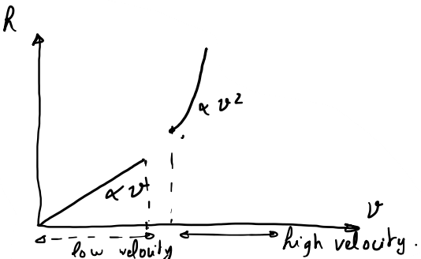

# Chapter 0 - Analysis Revsion

1. Gradient
$$
\vec{grad}=\vec{\nabla}=\frac{\partial v_x}{\partial x}+\frac{\partial v_y}{\partial y}+\frac{\partial v_z}{\partial z}
$$

2. Divergence
$$ \text{div} \vec{v}=\frac{dv_x}{dx}+\frac{dv_y}{dy}+\frac{dv_z}{dz}
$$

3. Curl or rotation
$$ \vec{\text{rot}}\vec{v}=\left(\begin{matrix} \frac{dv_z}{dy}-\frac{dv_y}{dz}\\\frac{dv_x}{dz}-\frac{dv_x}{dz}\\\frac{dv_x}{dy}-\frac{dv_y}{dx}\\\end{matrix}\right)
$$
$$\vec{rot} \vec{v}=\vec{\nabla}\wedge\vec{v}$$

4. Scalar Laplacian
$$\Delta f = \vec{\nabla}\cdot(\vec{\nabla} f) = \frac{\partial^2 v_x}{\partial x^2}+\frac{\partial^2 v_y}{\partial y^2}+\frac{\partial^2 v_z}{\partial z^2}
$$

5. Vector Laplacian
$$\vec{\text{Lap}} (\vec{v}) = \vec{\Delta} \vec{v} = \vec{\text{grad}}(\vec{div} \vec{v}) - \vec{rot}(\vec{rot}\vec{v}) $$

6. Circulation of vector
$$ C_{\text{AB}}(\vec{v})=\int_{\text{AB}} \vec{v}\cdot\vec{dl}$$

7. Flux of vector
$$\phi_{\text{(S)}}=\iint_{(S)}\vec{v}\cdot\vec{dA}$$

8. Stokes Theorem:
$$\int \vec{v}\cdot\vec{dl}=\iint \vec{rot}\vec{v}\cdot \vec{dA}$$

9. Gauss-Ostogradski Theorem
$$\iint \vec{v}\vec{dA}=\iiint \text{div}\vec{v} dV$$

10. Reynold's Transport theorem
$$F(t)=\iiint f(\vec{r},t)dV$$
$$\frac{dF}{dt}=\frac{d}{dt}\iiint_{V_s} f(\vec{r}, t)dV$$
$$\frac{dF}{dt}=\iiint_{\text{Control} \atop \text{Volume}} \frac{df}{dt}dV +\iint_{\text{Control} \atop \text{Surface}} f\cdot\vec{v}\cdot\vec{n}dA$$

  

11. Applying Mass Conservation to Reynold's Theorem  

$$\frac{dM}{dt}=\iiint_{\text{Control} \atop \text{Volume}}\frac{d\rho}{dt}dV+\iint_{\text{Control} \atop \text{Surface}}\rho\cdot\vec{v}\cdot\vec{n}\cdot dA$$

Further simplification yields:

$$\frac{d\rho}{dt}+\text{div}(\rho\vec{v}) = 0$$
For incompressible fluids: $\frac{d\rho}{dt}=0$ thus $\text{div}(\rho\vec{v})=0$

# Chapter 1 - Introduction to Fluid Mechanics

- Fluid study is divided into two types: static and dynamic.  
- There's two types of fluids, Newtonian whose viscosity only depend on temperature, and non-Newtonian whose viscosity depends also on flow's velocity and other parameters.  
- An Idean Fluid has viscosity of zero.
- Almost all compressible fluids ($\dfrac{\rho}{dt}\ne 0$) are gases.
1. Density
$$\rho =\frac{\text{mass}}{\text{volume}}\left(\frac{kg}{m^3}\right)$$
2. Specifc Gravity
it's fluid's density relative to that of water
$$s.g = \frac{\rho_{\text{fluid}}}{\rho_{\text{water}}}$$

3. Specific Weight
$$\gamma=\frac{\text{weight of fluid}}{\text{volume of fluid}}=\rho\cdot g\left(\frac{N}{m^3}\right)$$

4. Viscosity  
A parameter that describes the friction force between two layers of the same fluid.
$$Fr=\mu\cdot A\cdot\frac{\Delta v}{\Delta z}$$  
$\mu$: dynamic viscosity $^{N.s}/_{m^2}$  
$^{\Delta v}/_{\Delta z}$: Change of velocity with respect to $z$ $^1/_s$.  
A: Area of layer  

5. Shear Stress  
Pressure exerted by friction parallel to the layer
$$\tau=\frac{F}{A}=\mu\frac{\Delta v}{\Delta z}$$

6. Kinematic Viscosity
$$\upsilon=\frac{\mu}{\rho}$$

# Chapter 2 - Fluid Statics

$$dP = -\gamma dz$$
where $\gamma=\rho\cdot g$

If we integrate the above equation
$$\frac{P}{\gamma}+z=\text{cst}$$
which is applicable to all points, $z$ is the geometric elevation, $\dfrac{P}{\gamma}$ is the hydrostatic elevation, which you can think of as the negative height from the surface.

## Pressure on a Plane Surface

$$P=\gamma l\sin \alpha$$

Location of Force:
$$l_f=\frac{\gamma\iint l^2 \cdot dA}{F}$$

## Pressure on a Curved Surface

The pressure along the curve is divide into horizontal and vertical, the horizontal one is calculated as in the previous section, and the vertical one is constant consisting of the weight of fluid above it.

## Buoyancy and Stability of Floating Bodies

$$F_{\text{float}}=\gamma\cdot V_{\text{submerged}}=\rho\cdot g\cdot V_{\text{submerged}}$$

## Tank of Liquid Under Acceleration

$$\frac{dP}{dx}=-\rho a_x=-\frac{\gamma}{g}a_x$$
$$\frac{dP}{dy}=-\rho a_y=-\frac{\gamma}{g}a_y$$
$$\frac{dP}{dz}=-\rho a_z -\gamma=-\gamma(\frac{a_z}{g}+1)$$

Slope of water surface:
$$\frac{dz}{dx}=\frac{-\frac{a_x}{g}}{\frac{a_z}{g}+1}$$

## Fluids in Rotation

$$\frac{dP}{dr}=\frac{v^2\gamma}{rg}=\omega^2r\frac{\gamma}{g}$$
$$\frac{dP}{dz}=-\gamma$$

# Chapter 3 - Kinematics of Fluids (Incompressible Ideal Fluid)

A flow is steady if $\frac{dV}{dt}=0$ $\forall t$

## Vorticity

$$\xi=\frac{\text{circulation}}{\text{area}}=\vec{\text{rot}}(\vec{v})$$

if $\vec{\text{rot}}(\vec{v})=0$ then the flow is irrotational.

## Bernoulli's Equaiton (Work-Energy Equation)

if there's no flow
$$\frac{P}{\gamma}+z=\text{cst}$$

if there's flow
$$\frac{P}{\gamma}+z+\frac{v^2}{2g}=\text{cst}$$

The term $\dfrac{v^2}{2g}$ is kinetic elevation, the above equaiton provides energy per unit of weight.

$$\frac{P}{\rho}+gz+\frac{v^2}{2g}=\text{cst}$$

The above equation provides energy per unit of volume.

## Turbine & Pump (Work-Energy Equation)

$$\frac{P}{\gamma}+z+\frac{v^2}{2g}+h_p=\frac{P}{\gamma}+z+\frac{v^2}{2g}+h_t$$

Power of pump:
$$P_{\text{pump}}=q_v\gamma h_p$$

where $q_v$ is the flow volume per second

## Continuity Equation

$$\sum q_{v_{\text{in}}}=\sum q_{v_{\text{out}}}$$

where $q_v$ is the volume rate. This equation can be derived from Reynold's transport theorem.

## Bernoulli's Equation with Vorticity

$$\frac{P}{\gamma}+z+\frac{v^2}{2g}=\text{cst}-\frac{1}{g}\int \xi(udz-wdx)$$

where $\xi=\dfrac{du}{dz}-\dfrac{dw}{dx}$.  
The whole left term is know as the energy line, $\dfrac{P}{\gamma}+z$ is called Hydraulic grade line (we can think of it as gravitational potential energy).

# Chapter 4 - The Impulse Momentum Principle

$$\sum F_{\text{ext}}=\frac{d}{dt} m\cdot \vec{v}$$

$$\sum F_{\text{ext}}=\frac{d}{dt}\iiint_{\text{system}}\rho\cdot \vec{v}\cdot dv $$

$$\sum F_{\text{ext}}=\frac{d}{dt}\iiint_{\text{Control}\atop\text{Volume}}\rho\cdot \vec{v}\cdot dv +\oiint_{\text{Control}\atop\text{Surface}} (\rho \cdot\vec{v})\cdot \vec{v}\cdot\vec{dA}\\+\iint_{\text{in}} (\rho \cdot\vec{v})\cdot \vec{v}\cdot\vec{dA}+\iint_{\text{out}} (\rho \cdot\vec{v})\cdot \vec{v}\cdot\vec{dA}$$

# Chapter 5 - Flow of Real Fluid

In real fluids there exists shear stress between the fluid and the boundaries, and between the fluid's layers themselves.

$$\tau=\mu\frac{dv}{dz}$$

## Reylond's Number

$$Re = \frac{\rho dv}{\mu}$$

if $Re < 2100$ we have a laminar flow, if $4000<Re< 10^5$ we have a smooth turbulen flow, other wise rough turbuelent flow.  
In laminar flow, the velocity direction of every particle is the same.

## Head/Energy Loss

head loss is the energy lost per unit weight.

### Linear Head Loss
$$h_l=\lambda\frac{L}{d}\frac{v^2}{2g}$$

where $L$ is the length of pipe, $d$ is diameter of pipe, $v$ is the mean velocity of flow and $\lambda$ is the coefficient of friction.  
It can also be defined as:
$$h_l=\frac{\tau_oL}{\gamma R_H}$$
where $R_H$ is the hydraulic radius defined as $\dfrac{\text{Area}}{\text{Perimeter}}$, $tau_o$ is the shear stress on the walls, and $L$ is the length of the pipe.

### Singular Head Loss
$$h_s=K_s\frac{v^2}{2g}$$

This loss is due to pipe bends and reducers. $K_s$ is the singular head loss, and it's defined by the pipe manufacturer, and it's a function of the deviation angle, it increases with devation.

## Coefficient of Friction
Regardless of the region of flow, coefficient of friction is defined as:
$$\lambda=f\left(v, \frac{\varepsilon}{d}\right)$$

where $\dfrac{\varepsilon}{d}$ is the relative roughness of pipe.  
The value of $\lambda$ can be extracted from Moody's Diagram.  
$\lambda = \dfrac{64}{R_e}$ in the laminar flow.  
$\lambda=0.316 R_e^{-0.5}$ for smooth turbulent flow.  
$\lambda = 0.79\sqrt{\dfrac{\varepsilon}{d}}$ for rought turbulent flow.

The overall Work-Energy Equation will be
$$\frac{P}{\gamma}+z+\frac{v^2}{2g}+h_p=\frac{P}{\gamma}+z+\frac{v^2}{2g}+h_t+h_l$$
## Navier Stokes Equation

$$\vec{a}=\frac{d\vec{v}}{d t}+\left(\vec{v}\cdot\vec{grad}\right)\vec{v}=-\frac{1}{\rho}\vec{\nabla}P-g\vec{x}+\upsilon\vec{\Delta}\vec{v}$$